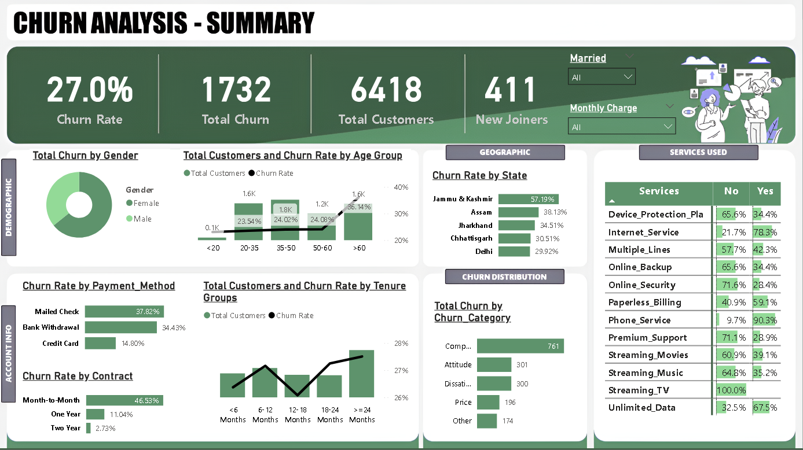
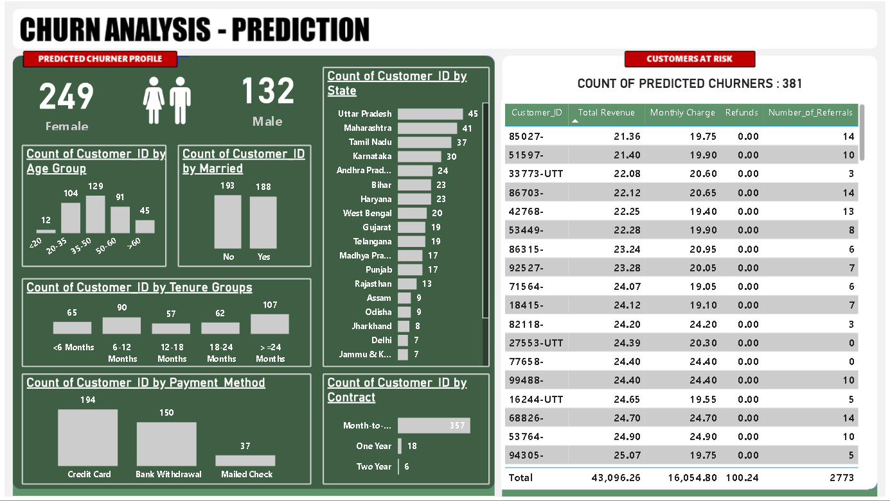

# 📦 Customer-Churn-Analysis

A complete **end-to-end data science project** to analyze customer churn using **SQL Server**, **Power BI**, and **Machine Learning**.  
This solution covers:

- **ETL** in **Microsoft SQL Server**
- **Dashboarding** in **Power BI**
- **Exploratory Data Analysis (EDA)** using Python
- **Predictive Modeling** using:
  1. **XGBoost Classifier**
  2. **Random Forest Classifier**
  3. **Decision Tree Classifier**

---

## 🚀 Project Overview

**Customer churn** is a major concern in the **telecom industry**. This project analyzes churn patterns, identifies key drivers, predicts future churners, and profiles at-risk customers using:

- A **summary dashboard**
- A **prediction report**
- A trained **machine learning model**

---

## ✅ Key Objectives

### 🎯 Project Goals:

1. **Create an ETL process** and **Power BI dashboard** to analyze customer data across:

   - **Demographics** (e.g., age, gender)  
   - **Geography** (e.g., state)  
   - **Payment & Account Info** (e.g., contract type, payment method, tenure)  
   - **Subscribed Services** (e.g., internet, phone, streaming)

2. **Profile churners** and identify focus areas for **marketing campaigns**.

3. **Predict future churners** using a machine learning model.

### 📊 Metrics Used:

- **Total Customers**  
- **Total Churn**: Number of customers lost  
- **Churn Rate**: % of customers who left  
- **New Joiners**: Recently acquired customers

---

## 🧰 Tech Stack

| Component         | Tools & Libraries                                      |
|------------------|--------------------------------------------------------|
| **Database**      | Microsoft SQL Server                                   |
| **Data Analysis** | Python (`pandas`, `matplotlib`, `seaborn`)             |
| **Dashboarding**  | Power BI                                               |
| **ML Modeling**   | `scikit-learn`, `xgboost`, `imbalanced-learn`, `pickle` |
| **Notebook**      | Jupyter Notebook                                       |

---

## 🔄 Workflow

### 0️⃣ Dataset Overview

<p align="center">
  
</p>

**Dataset Columns Grouped Into:**

- **Customer ID** (unique key)  
- **Personal Info** (gender, senior citizen, etc.)  
- **Account Info** (contract type, tenure, etc.)  
- **Service Subscriptions**  
- **Revenue Data**  
- **Customer Status** (Target column)

---

### 1️⃣ ETL & Data Preparation — *SQL Server*

- **Database & Table Creation**
- **Removed Duplicates**
- **Handled NULL Values**
- **Created Views**

**ETL Framework:**

- **Data Source:** CSV file  
- **MS SQL Server Management Studio:** Import & Transform using Wizard  
- **SQL Server DB:** Store data & create analytical views  

---

### 2️⃣ Dashboarding — *Power BI*

Used **Power Query Editor** to create new columns such as `Chain Status` and `Monthly Charge Range`.

#### 📍 Summary Page Measures:
```DAX
Total Customers = COUNT(Customer_Data[Customer_ID])

Total Churn = SUM(Customer_Data[Churn Status])

New Joiner = CALCULATE(COUNT(Customer_Data[Customer_ID]), Customer_Data[Customer_Status] = "Joined")

Churn Rate = [Total Churn] / [Total Customers]
```

#### 📍 Prediction Page Measure:
```DAX
Count Predicted Churner = COUNT(Predictions[Customer_ID]) + 0
```

---

## 📊 Sample Visuals

### 📌 Summary Page
<p align="center">
  
</p>

### 📌 Prediction Page
<p align="center">
  
</p>

---

## 🔍 Key Insights (from Summary Page)

- **Senior Customers** (age > 60) have a significantly higher churn rate.
- **Short Tenure Churn**: Users with < 2 months tenure are more likely to churn. In contrast, users with **1-year or 2-year contracts** show much lower churn.
- **Gender Disparity**: **Female customers churn more** than male customers.
- **Service-Based Churn**: Users with **Phone, Internet, and Unlimited Data** services show **60%+ churn rate**.

---

## 🧠 Machine Learning Module — *Churn Prediction*

This Jupyter notebook builds and evaluates ML models to **predict churn**, enabling targeted retention strategies.

### 📌 Key Features

#### 🔧 Data Preprocessing:
- Removed non-informative columns (e.g., `customerID`)
- Handled missing values in `TotalCharges`
- Encoded categorical variables using **LabelEncoder**

#### ⚖️ Class Imbalance Handling:
- Applied **SMOTE** (Synthetic Minority Oversampling Technique)

#### 🏗️ Model Building:
- Implemented:
  - **Decision Tree Classifier**
  - **Random Forest Classifier**
  - **XGBoost Classifier**

#### 📊 Model Evaluation:
- **Accuracy Score**
- **Confusion Matrix**
- **Classification Report** *(Precision, Recall, F1-score)*

#### 💾 Output:
- Exported predictions to `.csv` for Power BI visualization
- Saved trained model using `pickle` for future use

---

## 📈 Results

- Built a robust **ML pipeline ready for deployment**
- Delivered actionable **churn insights**
- Provided data-driven inputs for **retention strategies**
